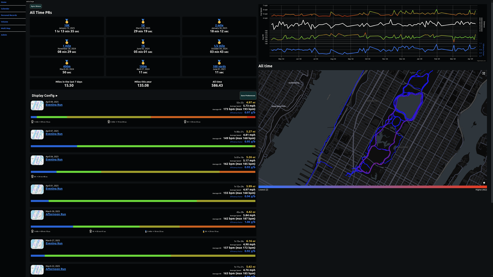
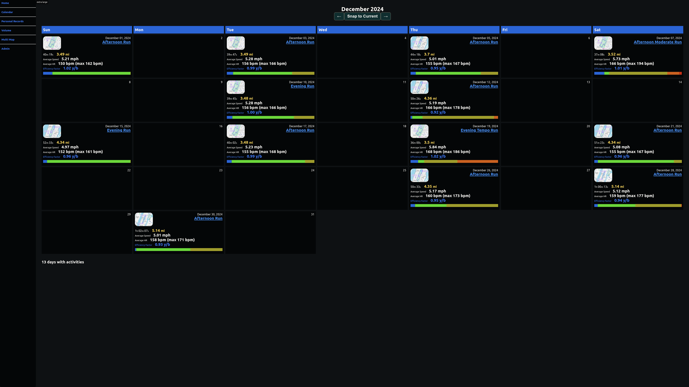
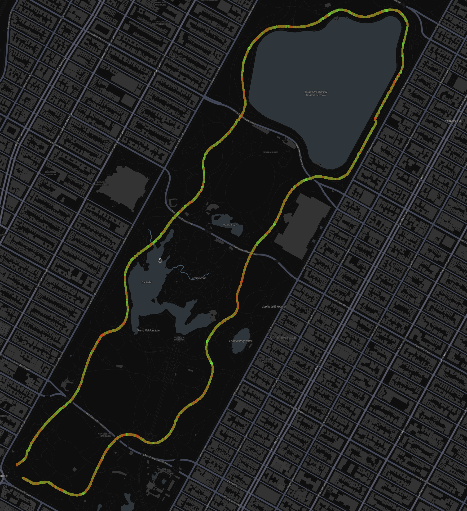
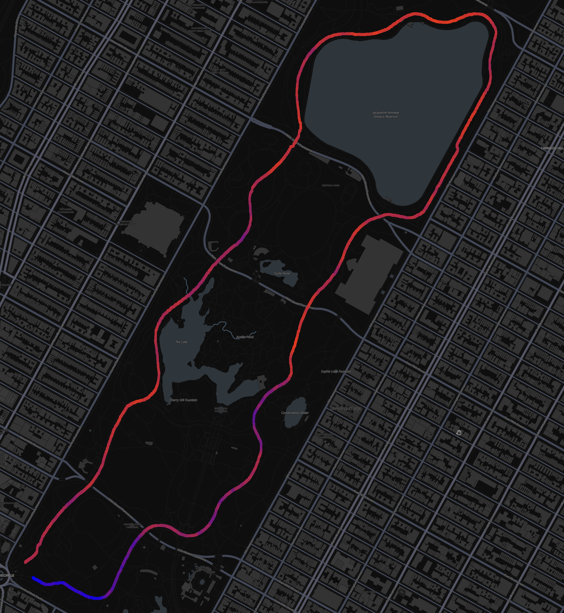
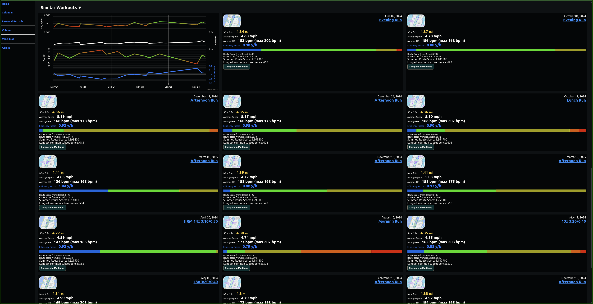
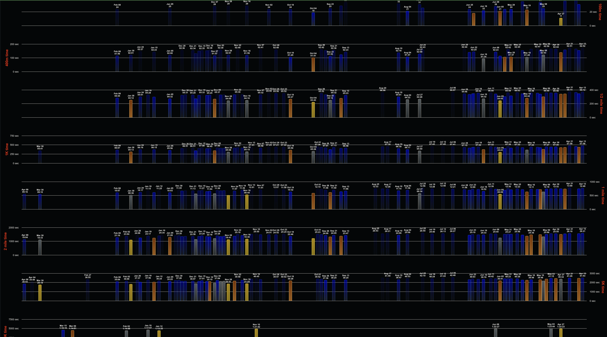
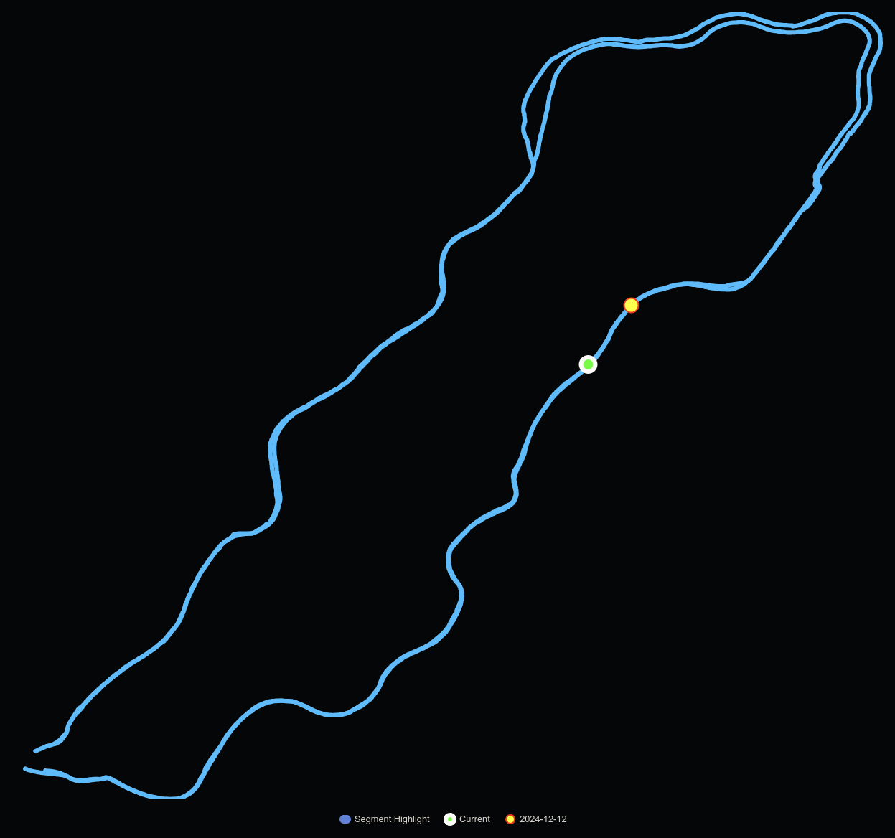

# running app

## What it is

This project visualizes the data collected by Strava.

### Dashboard


### Calendar


### Detail
<!-- 
#### Interactive Charts
 -->

#### Velocity Chart


#### Heart Rate Chart


#### Similar Workouts - Route Matching


### Heat Maps


### Personal Records

Top 10 Records Chart


### MultiMap

#### Race mode



## Getting local development started

### Create the following files if they don't already exist (see `./*.example.env` files)

- ./activities-service.env
- ./frontend.env
- ./image-service.env
- ./running-app-kafka.env
- ./strava-client.env
- ./strava-couch-db.env
- ./strava-mysql.env
- ./zookeeper.env

### Replace API Keys
If you renamed the `.example.env` files to `.env`, you will need to replace the placeholder values with your own API keys.

Search for `<REPLACE_WITH_YOUR_OWN_KEY>` in the `.env` files and replace it with your own API key.

### Run the following commands

```bash
docker-compose up -d
```

### To stop the services

```bash
docker-compose down
```

### To view the logs for all services

```bash
docker-compose logs -f
```

### To view the logs for a specific service

```bash
docker-compose logs -f <service-name>
```

