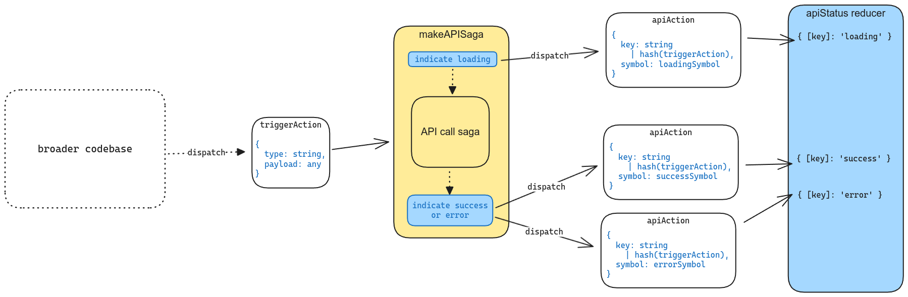

# API Loading and Caching

## Components of the API loading & caching mechanism:

1. triggerAction
1. apiSaga: `makeAPISaga(clientSaga)`
1. apiAction
1. apiStatus reducer
1. hooks:
    - useTriggerActionIfStatus
    - useGetApiStatus

## Flow

1. Somewhere in the broader codebase dispatches an action whose type triggers the `apiSaga` which wraps the `clientSaga` that does something else (calling the API).

1. The `apiSaga` first dispatches an action that indicates to the `apiStatus` reducer that its key is should be marked in a loading state.

1. The apiSaga calls the `clientSaga` that makes the API call.

1. If the `clientSaga` throws an error, the `apiSaga` will dispatch an action that indicates to the `apiStatus` reducer that its key should be marked as error.

1. If the `clientSaga` succeeds, the `apiSaga` will dispatch an action that indicates to the `apiStatus` reducer that its key should be marked as success.

## Caching

The key is not associated directly to the data in any part of the redux state. It is assumed that if a part of the code dispatches an action to trigger an API call, then that part of the code knows what data to expect. The key status in the API status reducer tells the status of the data, not the definition of the data.

## Hooks

### useTriggerActionIfStatus

Checks the status of the action you want to trigger. If the status is equal to the argument you provide (usually `'idle'`), then the action will be dispatched. The action is deferred until the status changes, assuming the component using the hook is still mounted. This is useful for requesting dependent data for an initial render.

### useGetApiStatus

Gives you the status of the action. This is useful for handling and error loading states of an API call made as a result of interaction.
